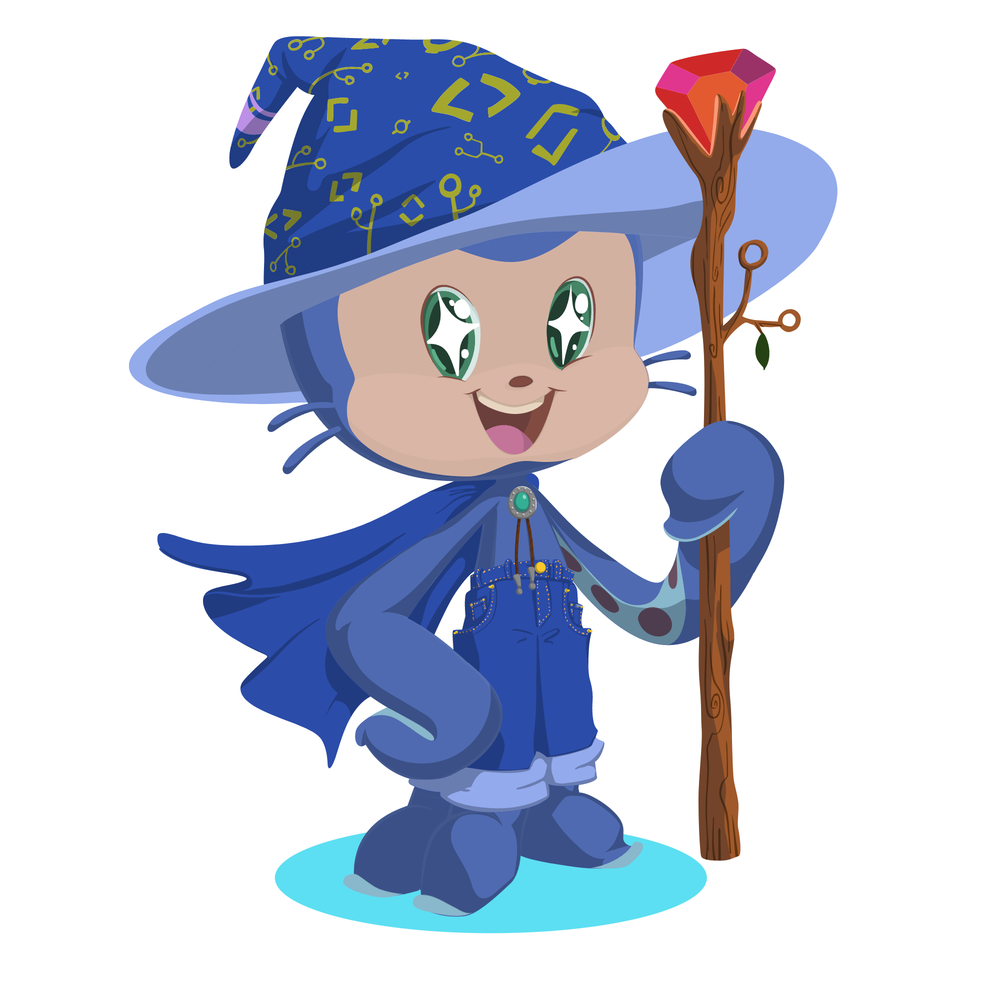

  

  <a href="https://github.com/Joao-Eduardo-AJ">
  
  

 
  
  
  
  
  
  
  
  
  
  
  
  
  
  
  
  
  ##
 

   
  
   
  

## A little about me!

I am a sociable, determined, and consistent front-end developer who prioritizes personal growth. I seek to understand people and the environment around me. I have numerous hobbies, including reading and sports. Since the beginning of 2022, I have been studying development-related content daily, balancing my degree in analysis and systems development with independent studies and integrating them as much as possible.
 
 

  
  
##

  <ul> 
    <li>📚 Studying Next.js and Tailwind</li>
    <li>💼 Working in the web development field</li>
    <li>😎 Future specialist</li>
    <li>🎨 Currently focused on front-end technologies</li>
    <li>🔜 Next technology to study: NODE</li>
  </ul>

